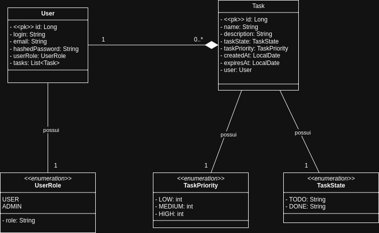
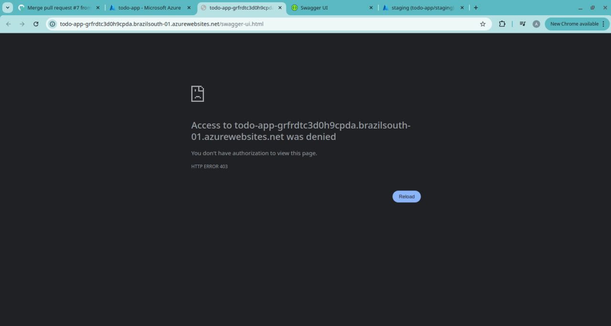
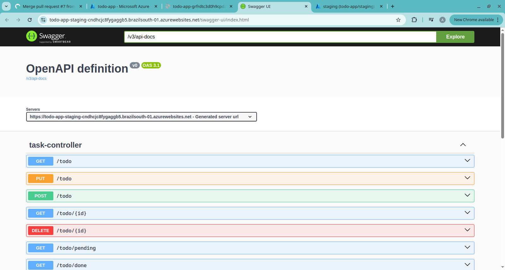
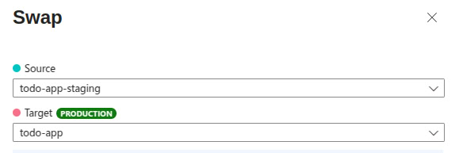
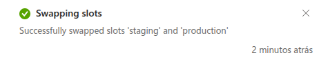
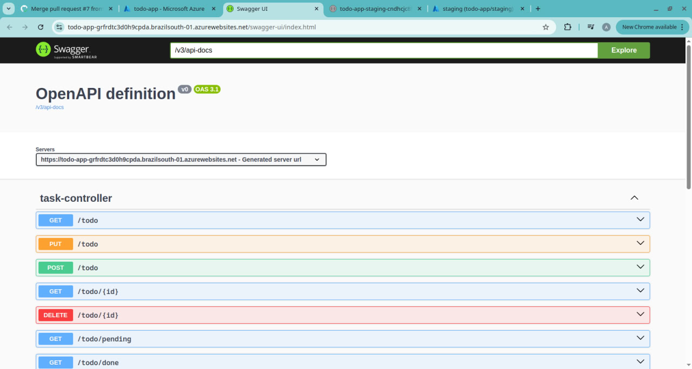
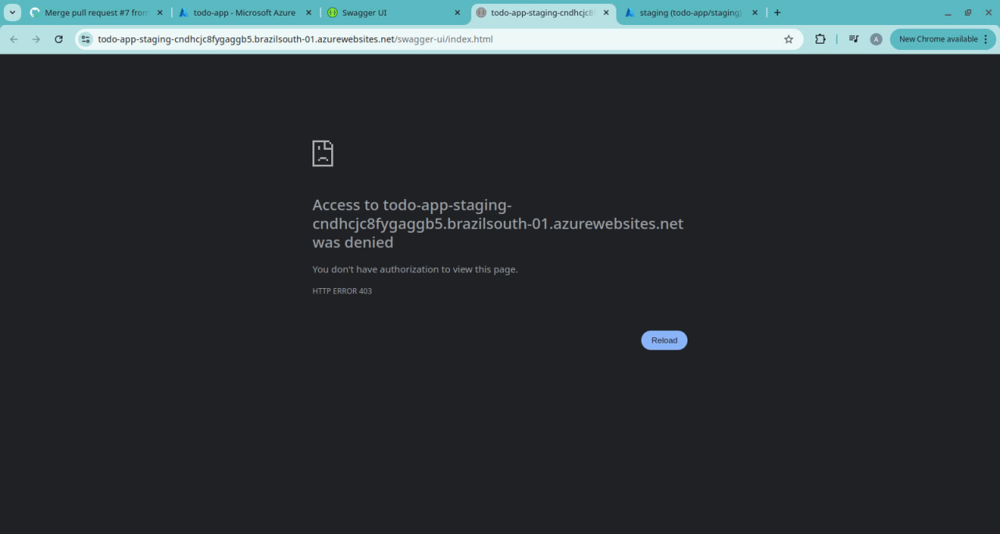

# API de Lista de Tarefas (To-Do List)

Um sistema de gerenciamento de tarefas (To-Do List) multiusuário, desenvolvido com o ecossistema Spring Boot. O projeto foi desenhado com foco em segurança, escalabilidade e boas práticas de DevOps.

## Características Principais

* **API RESTful:** Interface bem definida para manipulação de tarefas.
* **Autenticação e Autorização:** Segurança robusta implementada com Spring Security e JSON Web Tokens (JWT), garantindo que cada usuário acesse apenas suas próprias tarefas.
* **Pipeline de CI/CD:** Automação de build, testes e deploy configurada com GitHub Actions, agilizando a entrega de novas funcionalidades.
* **Deploy Automatizado na Nuvem:** Estratégia de deploy em múltiplos ambientes (staging/produção) na Microsoft Azure, garantindo alta disponibilidade (*zero downtime*) e segurança.
* **Containerização:** O projeto é containerizado com Docker, facilitando a configuração do ambiente de desenvolvimento e produção.
* **Documentação Dinâmica:** Endpoints documentados com Swagger (OpenAPI), permitindo fácil visualização e teste da API.

## Acesso à Aplicação

### Ambiente Online (Demonstração)

A API está disponível para demonstração no seguinte endereço:

**URL Base:** `https://todo-app-grfrdtc3d0h9cpda.brazilsouth-01.azurewebsites.net/`

**Documentação Interativa (Swagger):** `https://todo-app-grfrdtc3d0h9cpda.brazilsouth-01.azurewebsites.net/swagger-ui.html`

*Observação: O serviço pode estar indisponível.*

## Arquitetura e Diagramas

### Diagrama de Classes UML
Abaixo está o diagrama de classes que modela a estrutura da API. Sugestões de melhorias são sempre bem-vindas!

### Processo de Deploy Automatizado (CI/CD)
Este diagrama ilustra o fluxo do pipeline de integração e entrega contínua, desde o commit no repositório até o deploy em produção.

### Staging Environment e Swap
Alguns prints demonstrando o uso de Staging Environment na Azure. 

Production antes:

Staging antes:
 

Swap:

Swap bem sucedido:
  

Production depois:

Staging depois:

## Documentação da API

A tabela abaixo resume os principais endpoints disponíveis. Para uma documentação completa e interativa, acesse o [Swagger UI](#ambiente-online-demonstração).

| Método HTTP | Caminho         | Descrição                                    | Autenticação |
| :---------- | :-------------- | :------------------------------------------- | :----------- |
| `POST`      | `/auth/login`   | Autentica um usuário e retorna um token JWT. | Não          |
| `POST`      | `/auth/register`| Registra um novo usuário.                    | Não          |
| `GET`       | `/todo`         | Lista todas as tarefas do usuário (paginado).| Sim          |
| `GET`       | `/todo/pending` | Lista as tarefas pendentes do usuário.       | Sim          |
| `GET`       | `/todo/done`    | Lista as tarefas concluídas do usuário.      | Sim          |
| `GET`       | `/todo/{id}`    | Busca uma tarefa específica pelo ID.         | Sim          |
| `POST`      | `/todo`         | Cria uma nova tarefa.                        | Sim          |
| `PUT`       | `/todo`         | Atualiza uma tarefa existente.               | Sim          |
| `DELETE`    | `/todo/{id}`    | Deleta uma tarefa pelo seu ID.               | Sim          |
